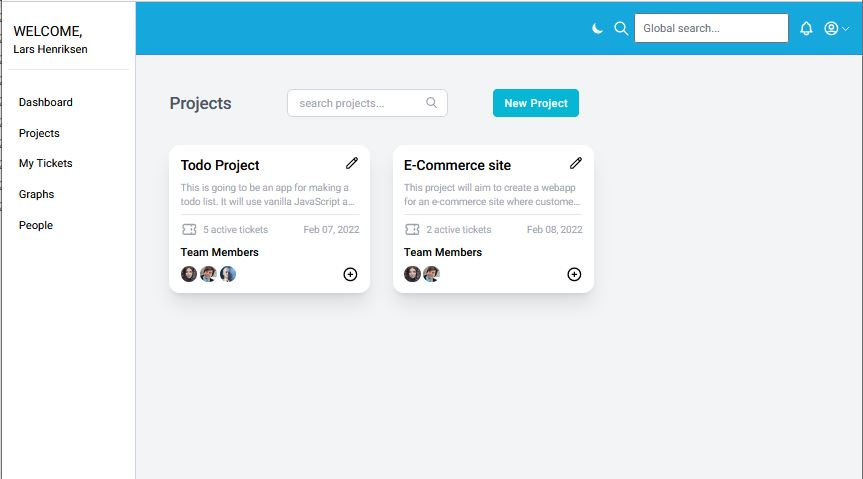
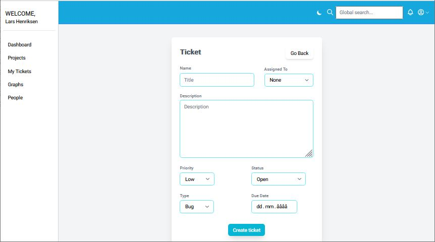

### Features

- Authentication and authorization (login, signup, and user roles)
- Create and update projects
- Create and update projects tickets
- Comments on tickets
- Filter project/ticket views by search input
- Data graphs
- Invite people to company/organisation
- Add people from company to project
- Change user role (admin only)
- Toggle light/dark theme

### Screenshots

### Links

- Live Site URL: [https://issue-hunter.herokuapp.com](https://issue-hunter.herokuapp.com)

### Built with

- NodeJS
- Express
- Angular
- MongoDB
- HTML5
- TailwindCSS
- TypeScript
- REST API

### What I learned

For my final exam project, I decided to create a product that is used in the real world. I used a MEAN stack with TypeScript also on the NodeJS+Express back-end, which was new for me. It took some getting used to, but once I got used to it, it was quite nice. 
It was also my first time trying out TailwindCSS which I enjoyed over the usual style of creating classes and defining rules in a seperate file. 
